# AptosTv

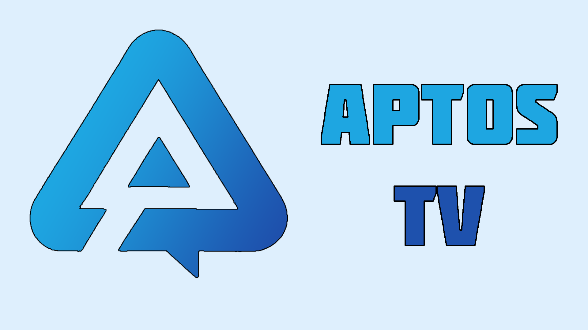

 A decentralized streaming platform where creators can create charity-based streams for social, environmental and economic causes. Powered by Aptos Network and Livepeer.

# FAST LINKS:

- **URL**: https://aptos-tv.vercel.app/
- **Video Demo**: [OPEN VIDEO](https://youtu.be/MZlkfOFihLU)
- **Aptos Implementation**: [JUMP TO SECTION](#aptos-network)
- **Nodit Implementation**: [JUMP TO SECTION](#nodit)

## Requirements

- Use Aptos Mainnet on Petra Wallet! (or any Aptos compatible wallet) 
  - Get it on Petra: https://petra.app/
  - Petra Wallet is set up on Mainnet by default

# Diagram:

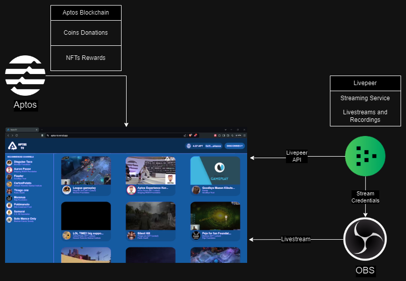

## Tech we Use:

- Aptos Network:
  - Coins Donations.
    - APT (Aptos Coin)
    - USDC (USD Coin)
    - USDT (Tether)
    - WETH (Wrapped Ether)
  - NFT
    - Special NFTs to unlock rewards.
- Nodit:
  - NFT Data Fetch and distribution.
- Livepeer:
  - RTMP URL:
    - Url to easily transmit from the OBS and start our transmission.
  - Livestreams and Recordings API:
    - Obtaining the url if a streamer is live.
    - Obtaining the last record of each streamer if he is offline.

# How it's built:

## Aptos Network:

The APTOS network was used because it allows more than 160,000 transactions per second, has low gas fees and also allows donation campaigns to be carried out in a decentralized manner without intermediaries and, above all, can easily distribute and reward NFTs.

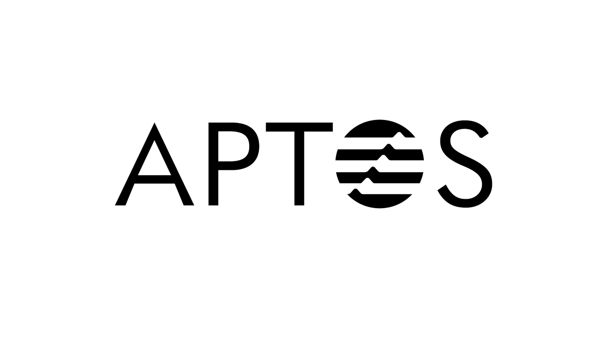

In order to enable the Aptos network and the interaction with the wallets, the page must first have a Wallet Provider configured within the application, in this case we used the [@aptos-labs/wallet-adapter-react](https://www.npmjs.com/package/@aptos-labs/wallet-adapter-react).

    <AptosWalletAdapterProvider
        plugins={wallets}
        autoConnect={true}
        dappConfig={{
            network: Network.MAINNET,
        }}
        onError={(error) => {
            console.log(error);
        }}
    >
        {children}
        ...
    </AptosWalletAdapterProvider>

The complete technical implementation is in the following link:

[**Complete code**](./aptostv/src/app/components/web3modal.js)

Finally, in order to be able to interact with the Wallet Provider in a simple way for the user, we created from scratch a "Connect" button which is already characteristic of the dApps of any chain.

This button provides us with a simple way to connect to Aptos from the Wallet Provider in addition to giving us our balance and when clicked it will open the Explorer to view our on-chain wallet.

The complete technical implementation is in the following link:

[**Complete code**](./aptostv/src/app/components/walletButton.js)

In order to obtain the balances of each of the Coins in the Aptos network, we used the Aptos Provider from the SDK for javascript [@aptos-labs/ts-sdk](https://www.npmjs.com/package/@aptos-labs/ts-sdk).

    const cryptoSetup = useCallback(async () => {
        const balancesTemp = await Promise.all(
            blockchain.tokens.map((token) =>
                provider.getAccountCoinAmount({
                    accountAddress: account.address,
                    coinType: token.address,
                })
            )
        );
        const balancesCharityTemp = await Promise.all(
            blockchain.tokens.map((token) =>
                provider.getAccountCoinAmount({
                    accountAddress: streamer.publicKey,
                    coinType: token.address,
                })
            )
        );
        setBalances(balancesTemp);
        setBalancesCharity(balancesCharityTemp);
        let flag = await checkNFT(account.address);
        setNftFlag(flag);
    }, [provider, streamer, account, setBalances, setBalancesCharity]);

The complete technical implementation is in the following link:

[**Complete code**](./aptostv/src/app/streamer/[streamer]/page.js)

Within our platform we have a summary where we can see all the donations in real time.

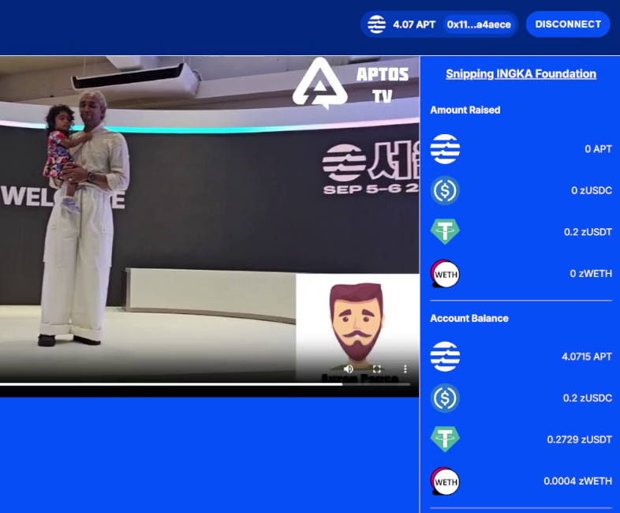

To make a donation, we generate a transfer from our wallet to the wallet of the charity or streamer that we want to support. This is done by selecting the token that we are going to donate, entering the amount and pressing the Donate button.

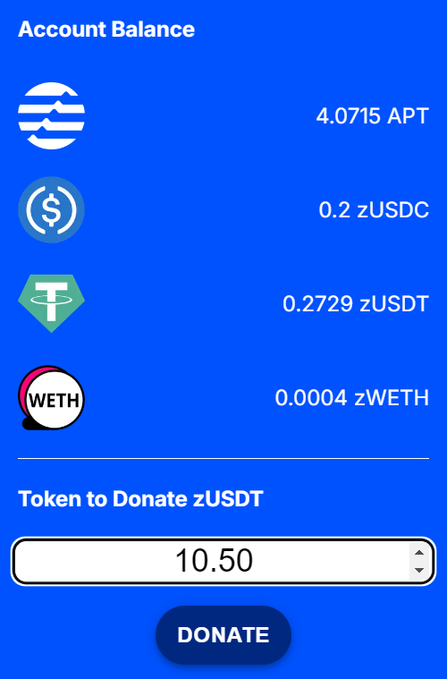 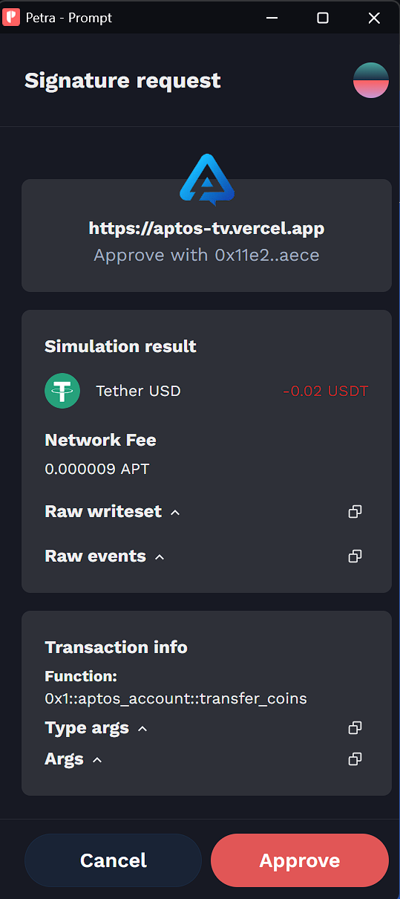

The code snippet that makes the signature request when pressing the button is the following.

    const transaction = {
        sender: account.address,
        data: {
            type: "entry_function_payload",
            function:
            token.address === blockchain.tokens[0].address
                ? "0x1::aptos_account::transfer"
                : "0x1::aptos_account::transfer_coins",
            typeArguments:
            token.address === blockchain.tokens[0].address
                ? []
                : [token.address],
            functionArguments: [
            streamer.publicKey,
            parseUnits(amount, token.decimals).toBigInt(),
            ],
        },
    };
    let response = await signAndSubmitTransaction(transaction);
    await provider.waitForTransaction({
        transactionHash: response.hash,
    });

The complete technical implementation is in the following link:

[**Complete code**](./aptostv/src/app/streamer/[streamer]/page.js)

# Nodit:

We use the Nodit platform to quickly review the NFTs held by wallets that make donations on the platform to improve the distribution of NFTs among them.

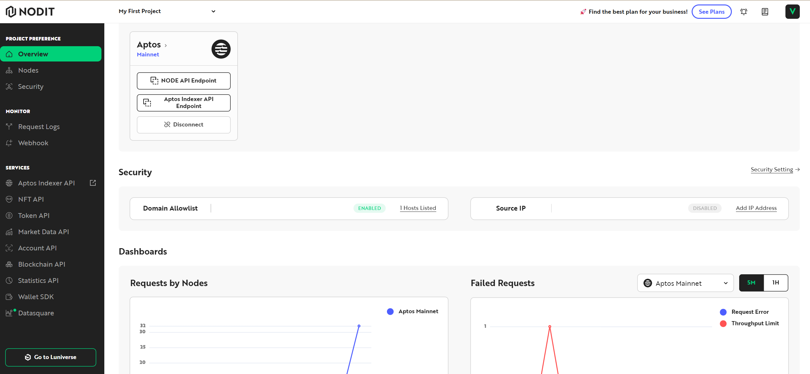

## NFT Rewards:

One of the most important features is an NFT lock that provides streamers with a tool to encourage users to make donations to their causes, either just to be able to see the exclusive content they generate, similar to the YouTube model, or even to obtain other types of rewards focused more on the platform.

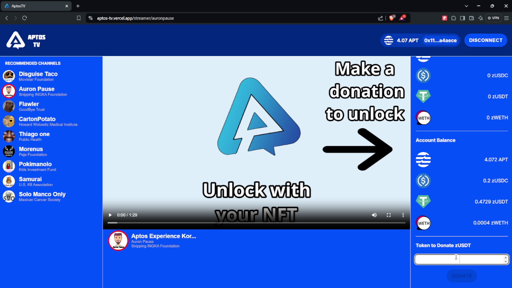

Once the donation configured by the Streamer is made, in this case the platform will give you an NFT when making any donation, considering that this is a POC, and you will be able to view it in your Wallet.

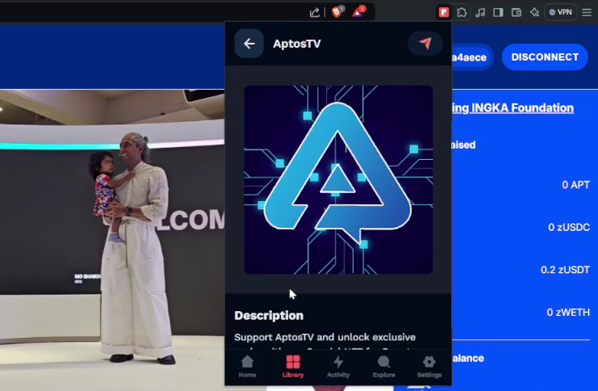

This is one of the mainnet NFTs we provide to our donors.

APTV NFT - Aptos Explorer: 
https://aptoscan.com/tokenv2/0x7f48203908ef905a0eeaa6de8d18d4ea58a72bb147cc19f4b9efa3660914ea41

The GraphQL Query used in the code snippet that checks if the connected wallet has the NFT is the following, it uses the Indexer API of [Nodit](https://nodit.io/).

    const data = (address) =>
        JSON.stringify({
            query: `{
                current_token_ownerships_v2(
                limit: 100
                offset: 0
                where: {
                    owner_address: {
                    _eq: "${address}"
                    }
                }
                ) {
                amount
                token_data_id
                current_token_data {
                    token_name
                    current_collection {
                    creator_address
                    }
                }
            }
        }`,
    });

The complete technical implementation is in the following link:

[**Complete code**](./aptostv/src/api/checkNFT.js)

## Livepeer:

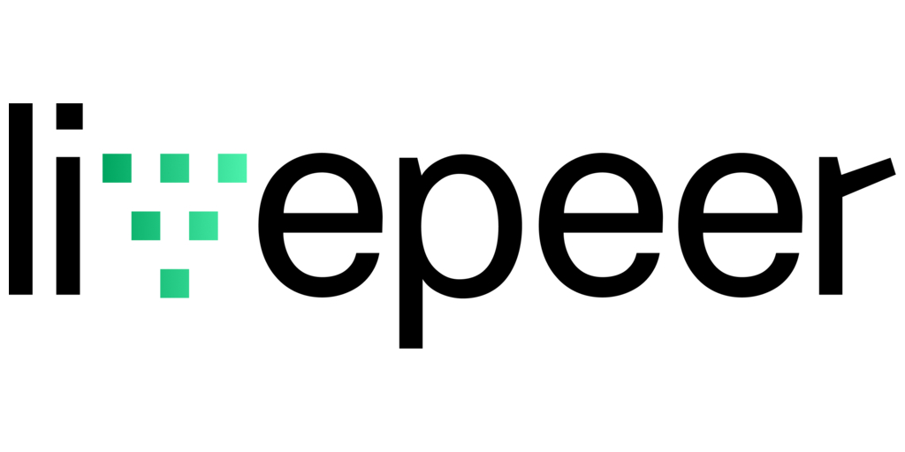

All the streaming services were done through Livepeer.

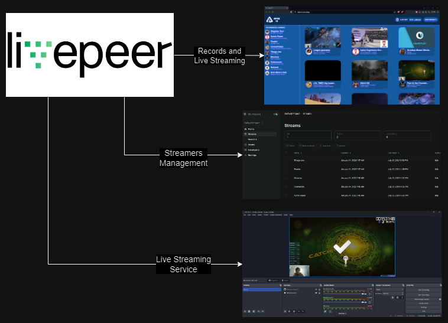

To manage Streamers, the profiles of each of the Streamers were created within the Livepeer dashboard, with which we were able to provide each Streamer with their keys to perform their Streams.

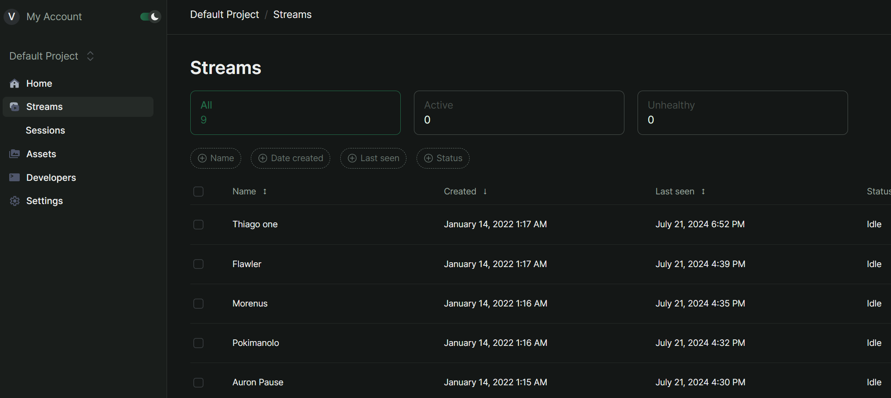

Thanks to the Livepeer APIs it was possible for us to obtain if the Streamers were doing a Live, thanks to this the viewers could always be aware when a live stream is made.

The section of code that allows us to obtain the profiles, recordings and states (live or offline) is the following.

Code Snippet:

    export async function getStreams() {
        const result = await livepeer.stream.getAll("<value>");
        let json = {};
        result.data.forEach((streamer) => {
            json[streamer.id] = streamer.isActive;
        });
        return json;
    }

The complete technical implementation is in the following link:
[**Complete code**](./aptostv/src/api/userData.js)

# References

https://www.twitch.tv/creatorcamp/en/connect-and-engage/charity-streaming/

https://www.donordrive.com/charity-streaming/

https://www.youtube.com/watch?v=Hh4T4RuK1H8
